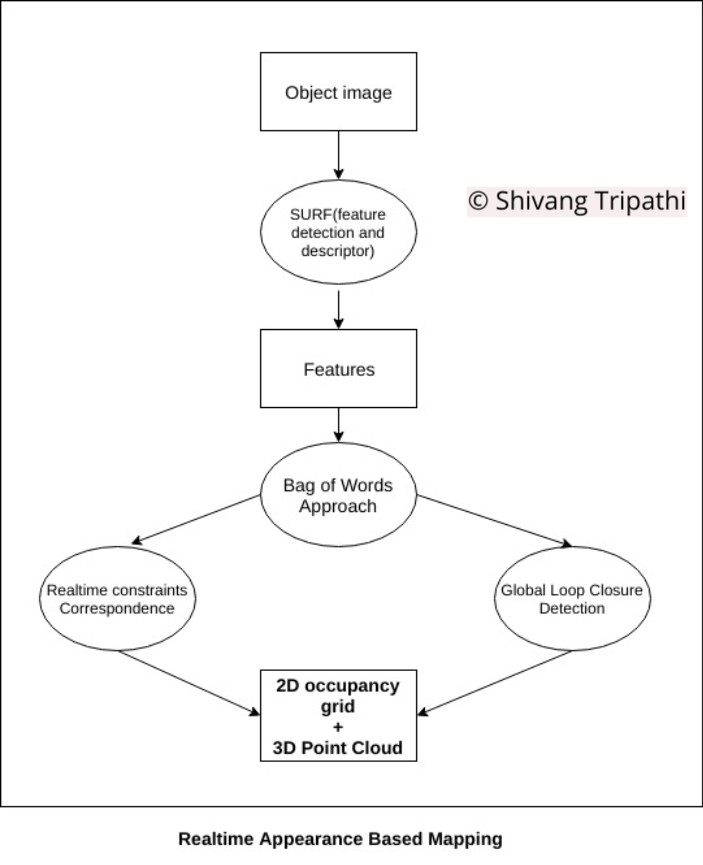
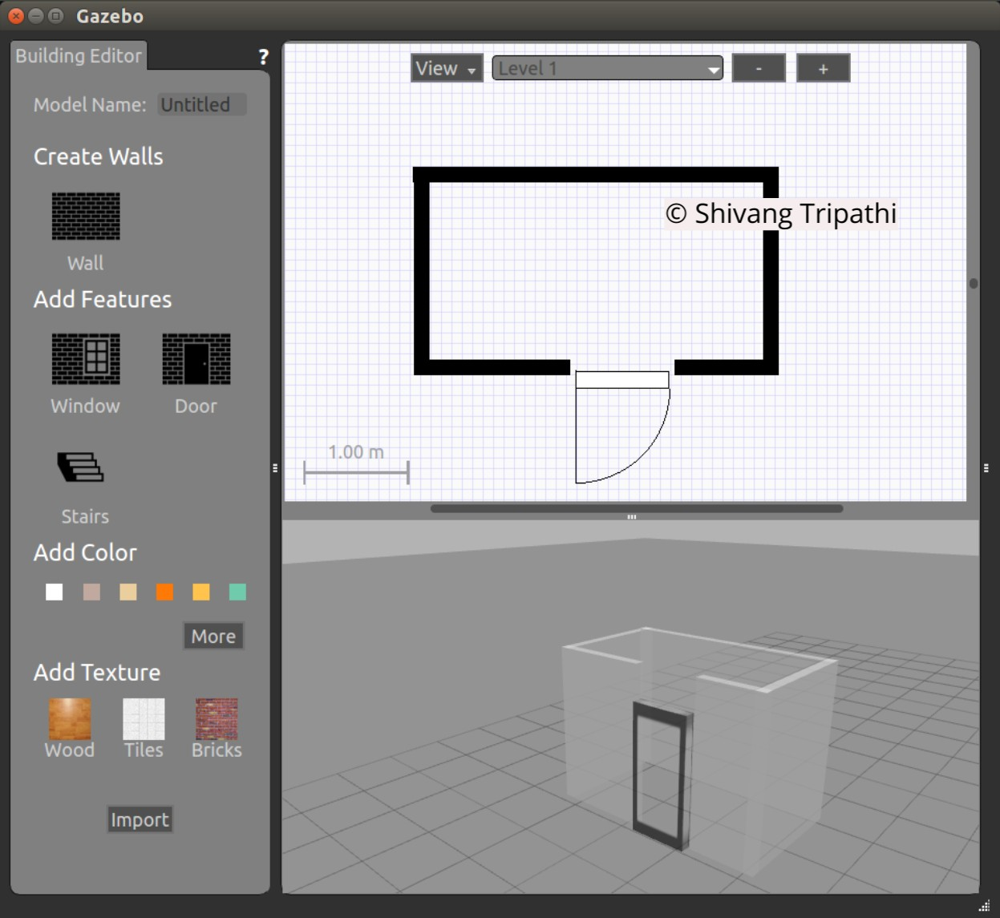
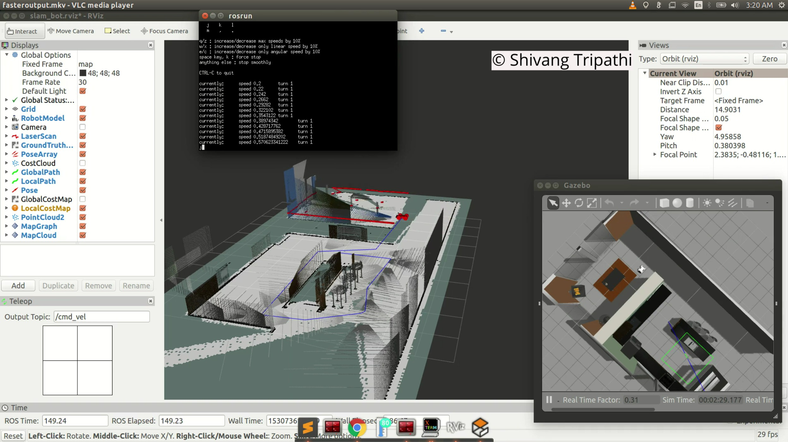

# Progress Report

# Abstract

This project aims to present the workflow for developing maps of the real world as well as simulated environments using the incoming data from various sensors like LIDAR and depth camera. The map of the environment is essential for the mobile robot navigation. The mapping for a supplied as well as a custom build simulated world is demonstrated. The performance of robot and mapping is compared in both the simulated worlds. Supporting images of the mapping procedure are provided to demonstrate the workflow.


# Introduction

In this project will be demonstrated the importance of a map for the mobile robot navigation. To achieve this, we need:
1. Correct hardware on the mobile robot: The depth sensor is used for capturing the depth of the obstacles wrt the robot pose.
2. Leverage the ROS wrapper of the RTAB-Map package for efficient realtime SLAM.
3. *2D occupancy grid* as well as a *3D octomap* for the 2 different simulated worlds:
	* A supplied Gazebo world
	* A custom-made Gazebo world



The features are detected and described using the SURF(speed up robust features) on the incoming image data. Using a **bag of words** approach, the RTAB-Map detects **global loop closures** of the features. When such a loop closure hypothesis is detected, a **constraint** is added to the system. A **graph optimizer minimizes the error** in the loop, so that the **realtime constraints are always respected in the large scale environments.** It outputs a 2D occupancy grid and 3D point cloud data for the estimated map.

The *2D occupancy grid* is used to represent the floor plan(in indoor use) and maps(in outdoor use). It is an equally spaced field of binary random variable each of which represent the probability about the presence of the obstacle at a given location.

A 3D octomap is based on the octree library. This has the advantage of multi- resolution in map. This facilitates easier, faster and more accurate trajectory generation by using coarse map for global planner and fine map for local planners.

The configuration used for the mobile robot as well as the environment is discussed to achieve better performance.


# Background

The navigation in an environment can be planned by the ROS Navigation Stack but it requires the accurate map of the environment to plan the most efficient trajectory from the start pose to the goal pose of the robot.
In most of the cases, a *rigid and fixed is not useful because most of the environment keeps on constantly or frequently changing*. Also, the map should be *lightweight enough be handled by the constrained memory and processing power of a mobile robot*.
To construct a map of the environment, the data from sensors that can detect the obstacles are used. LIDAR and RGB-D cameras work best for this job. The LIDAR provides the 2D occupancy grid and the 3D point cloud is generated using the RGB-D camera.

This arises a need for maps that are:

* Providing realtime map update to handle the constantly changing environment.
* Probabilistic
* Higher Accuracy with lower resolution.

But mapping is a challenging problem because of the various reasons like:

1. Huge hypothesis space: Very large number of maps are possible.
2. Continuous state space.
3. Mapping Large areas requires large amount of data to be collected and processed.  
4. Area being larger than the robot's _perceptual range_.
5. Noise sensor(perception, odometry) measurements and actuators.
6. Perceptual ambiguity: When 2 places look alike, its difficult for robot to decide if place is new or already visited.


<!-- Collect instantaneous poses and obstacles 
Form resulting map
Localize the robot wrt the known map.
 -->

3D mapping is more computationally expensive than 2D mapping but it is necessary to expand the functionality of a robot in the real 3D world. 3D mapping would enable:
1. Flying robots to plan their trajectory by avoiding the obstacles 
2. Robots with manipulator to change the state of the physical world around it reliably.

Mapping of the 3D world is important because it helps us plan trajectories for the:
1. Helps the drones to plan .
2. The planners to interact more efficiently with the objects around the robot.


# Scene and robot configuration
Gazebo model `SLAMHome` was created using the Gazebo Model Editor and was roughly inspired by the map of a typical house. This model was saved. Then a new Gazebo world `myHome.world` was made and the custom model `SLAMHome` was imported in it. This was saved as `myHome.world` for all the further usage of mapping.

The robot consists of the LIDAR sensors and a RGBD camera. This approach was found to be much better than just using the RGBD camera and running the `depthimage_to_laserscan` nodelet. The nodelet was computationally intensive in real time. With the LIDAR readings, higher robot speeds could be commanded without any loss of map quality. Also, the range of LIDAR sensing was higher which led to mapping of larger portion of the environment in lesser time.


The **Gazebo Building Editor** can be used to build new worlds that can provide 
1. A quick way to test the robot in that environment.
2. Various different floor plans can be constructed with varying imported meshes.



##### Gazebo Building Editor

The walls can be constructed and simultaneously viewed in the simulator. Features like windows, doors and stairs can be added along with custom designed meshes on them. This can be saved as a model that can later be imported in a Gazebo `world`. After creating the `MyHome` model, it was imported and the robot in the Gazebo `world` named `myHome.world`. This world is specified in the `launch` file through the script `rtab_run`. The `world` file opens up custom world and the robot at predefined locations with respect to the world.

#### Steps to run the project

1. Run the `rtab.sh` script in the terminal.

```sh
./rtab.sh
```

2. Press 'y' or 'n' to delete or keep the previous database.
3. Enter the letter shown to open one of the two Gazebo worlds.
4. Now, the Gazebo world is launched, robot is spawned in that world, Rviz opens up to show the visualizations.
5. Use the teleoperation node to move the robot in the world for mapping.
6. On Rviz can be seen the 2D occupancy grid and 3D octomap of the mapped environment.
7. Close terminals using Ctrl+c, rtab_map node saves the data in `~/.ros/rtabmap.db`

# Results

For teleoperation, using the linear speed as 0.5 m/s and angular speed as 1 rad/s for optimal results.

The `rtabmap.db`, `pgm` and `yaml` files for
1. The supplied world(kitchen_dining) can be found [here](https://drive.google.com/open?id=1itZbIdIlh9kvhpiWelsUZFzgV-x0vX6L).
2. The custom world(myHome) can be found [here](https://drive.google.com/open?id=1mbffNhK0Q41BJGNbQ1cTVeG6FuRwtG-B).

The images showing the 3D occupancy grid of the custom world `myHome` are provided below.

 

##### The mapping of the custom made myHome Gazebo world 

 

The images showing the 3D occupancy grid of the supplied world `kitchen_dining.world` are provided below.

 

##### The mapping of the Supplied Kitchen Dining Gazebo world 

 


# Discussion 

Factors that were found to be leading to the map getting spoiled were:

1. Increasing the speed of the mobile robot above 0.5 meter/second.
2. Moving backwards.
3. Rotating faster than 1.3 rads/second
4. keeping non-distinctive obstacles in the environment

The mapping performance can found to be better in the custom world but that might be due to the higher memory requirements by the `kitchen_dining.world` thus leaving less memory for the mapping by RtabMap. But the supplied `kitchen_dining.world` was more feature rich that the custom `myHome.world`, thus leading to better feature detection by SURF(used internally by RTabMap).
These limits can be increased If the processing power increases. If the data can be processed faster, higher speeds of robot rotation and translation can be achieved. Also, loop closures could be detected faster.

The parameter tuning for Better Map Building lead to following values:

```
/slam_gmapping/agularUpdate to 0.1
/slam_gmapping/linearUpdate to 0.1
/slam_gmapping/lskip to 10
/slam_gmapping/xmax to 10
/slam_gmapping/xmin to -10
/slam_gmapping/ymax to 10
/slam_gmapping/ymin to -10
```

# Future Work
RTABMap was discovered to be an indispensable resource in the field robotics responsibly taking on the task of making sense of the physical world in a format that can be digested by the robots, which can thence be of use to mankind.
  
This tool can be leveraged to map the environment in constrained memory and processing power. Thus, They :

1. Can be run on the low cost hardware.
2. Can run for longer time on same battery power.
3. Can be used to make the robot make sense of
	* Constantly changing environment. 
	* Environment that was previously unknown.

In future, RTAB-Map can be leveraged for 
* Multi-session mapping can be used to *map different areas of the environment at different times*.
*  Multirobot systems: Multiple robots can be used to map the same area. This can speed up the mapping and lead to faster deployment of robots in the area.


